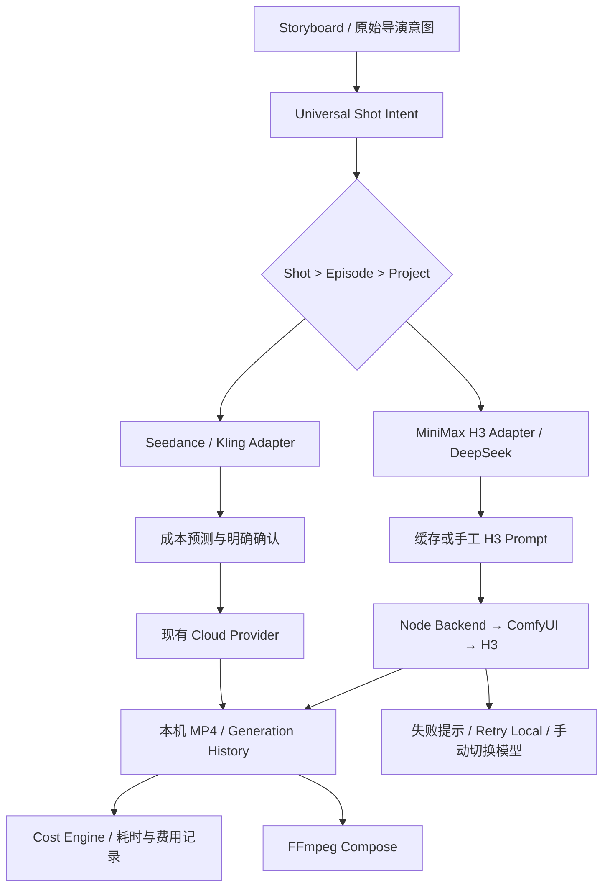

# LocalMiniDrama · Hybrid Local + Cloud

本地短剧制作工具：从 Story、Character、Scene、Storyboard 到逐镜头视频生成与 FFmpeg 合成。项目与素材保存在本机，每个 Shot 可以独立选择 Local MiniMax H3 或已配置的云视频模型，同一 Episode 可以混合使用多个 Provider。

增强版本仓库：[shingoxy/LocalMiniDrama](https://github.com/shingoxy/LocalMiniDrama)。

## Upstream & Credits

本项目基于 [LocalMiniDrama](https://github.com/xuanyustudio/LocalMiniDrama) 进行二次开发。感谢原作者 **xuanyustudio** 及原项目贡献者提供 Short Drama 基础架构、Story / Character / Scene / Storyboard、AI Provider、Video Pipeline、FFmpeg Compose，以及 Web / Desktop 基础。

本 fork 在这些基础上扩展 ComfyUI、MiniMax H3、Hybrid Local + Cloud Video、Per-shot Video Model Selection、Provider-specific Prompt Adapter、DeepSeek H3 Prompt Optimization 和 Cost Engine。以上增强功能属于本 fork 的扩展，不代表上游原版的功能或验证状态。

原项目 MIT License 与版权声明完整保留，见 [LICENSE](LICENSE)。

## 当前功能

| 制作环节 | 功能 |
| --- | --- |
| 剧本与项目 | 项目、剧集管理，剧本生成与编辑，角色、场景、道具提取 |
| 视觉资产 | 角色图、场景图、道具图、分镜图、参考帧、素材库 |
| Storyboard | 列表与画布，经典分镜与全能分镜，提示词编辑、批量生成 |
| AI Provider | 沿用现有文本、图片、视频接口；包括 DeepSeek、Seedream、Seedance、Kling 等配置与协议 |
| 混合视频 | 每个 Shot 单独选模型，项目默认、整集与多选批量设置，按 Shot 路由生成 |
| 本地 H3 | 直接连接现有 ComfyUI，提交 Workflow，Queue / Progress / History / Cancel，取回 MP4 |
| Prompt Adapter | Universal Shot Intent，DeepSeek 转换 H3 Prompt，缓存与手工编辑保护 |
| 成本管理 | 模型价格、月费分摊、重试预算、本机耗时、电费、单集与整季预测 |
| 最终合成 | 复用已有 FFmpeg Pipeline、字幕、音频、水印与视频合成 |

云模型列表来自当前启用的 AI 配置，实际可用模型及权限以账户和 Provider 为准。关闭或删除某个配置会使引用它的 Shot 报错，需要手动重新选择。

## 核心增强与 Architecture



Node Backend 直接使用 ComfyUI API，无额外 Worker。模型选择、Prompt Adapter、Local Provider 与 Cost Engine 各自集中在服务模块中。历史项目继续使用现有 SQLite 数据，通过增量 migration 增加字段。

## Technology Stack

| 层 | 技术 |
| --- | --- |
| Web | Vue 3、Vite、Element Plus、Pinia、Vue Flow |
| Backend | Node.js、Express、better-sqlite3、SQLite |
| Local Video | 现有 ComfyUI API、MiniMax H3 Workflow |
| Media | FFmpeg / ffprobe、现有本地存储与 `/static` |
| Desktop | 原有 Electron 项目；桌面安装包仍需单独构建与验证 |
| Tests | Node.js 内置 Test Runner，云视频 Provider 使用 Mock |

## Quick Start

### 已部署的 Windows 环境

继续使用现有启动方式。仓库提供的本地启动脚本要求 Node.js **24.5 或以上**；无需为 H3 集成重装 LocalMiniDrama、ComfyUI、CUDA、PyTorch 或模型。

```powershell
# 在 LocalMiniDrama 仓库根目录执行
.\local_dev.ps1 -NoBrowser
```

默认前端地址 `http://127.0.0.1:3013`，Backend `http://127.0.0.1:5679`。前端开发服务器代理 `/api` 与 `/static`。已有进程正常运行时可直接刷新网页。

### 从源码启动

已有依赖与配置时，分别在两个终端运行：

```powershell
cd backend-node
npm run dev
```

```powershell
cd frontweb
npm run dev
```

全新源码环境才需要在这两个目录各执行 `npm install`，从 `backend-node/configs/config.example.yaml` 建立私有 `config.yaml`，并准备现有 FFmpeg。Backend 包声明 Node >=18；上述 Windows 启动脚本使用更新的 Node 代理能力，因此要求更高。

Backend 启动时自动应用 migration。更新前备份 SQLite、素材与私有配置；不要用空数据库替换已有数据。备份与启动说明见 [LOCAL_DEPLOYMENT.md](LOCAL_DEPLOYMENT.md)。

## AI Provider Setup

在 **AI 配置** 中设置文本、图片、视频模型的 Provider、API 协议、Base URL、模型名和 API Key，并启用所需配置。已有 DeepSeek / Seedream / Seedance / Kling 接入继续保留。

- H3 自动优化需要一个启用的 DeepSeek 文本配置。优先使用默认 DeepSeek，否则使用启用的 DeepSeek 配置。
- 视频下拉框自动列出启用的视频配置中的模型，例如 Seedance 2.0 Fast、Seedance 2.5、Kling 与其他现有模型。
- Local MiniMax H3 固定作为本地选项，不要求创建云视频 API Key。
- 具体云协议仍由现有 Provider 实现处理，配置说明见 [AI 配置指南](docs/configuration.md)。该指南中的账户信息以 Provider 当前说明为准。

## ComfyUI + MiniMax H3

使用已经可以运行的 ComfyUI Desktop 和 H3 Workflow。Storyboard 页顶部打开 **ComfyUI / Cost Settings** 设置地址，默认 `http://127.0.0.1:8188`；Desktop 使用其他端口时填写实际地址，例如 `http://127.0.0.1:8000`。**Test Connection** 检查服务与模板所需节点，不生成视频。

当前模板模式为 **I2VA**：Storyboard 首帧图像 + Prompt → 带原生音频的 H3 视频。默认 5 秒输入、24 FPS。帧数沿用源 Workflow 的公式，5 秒请求产生 124 帧，实际时长约 5.17 秒，以 ffprobe 结果为准。

模板与映射位于：

- [minimax_h3.json](backend-node/configs/workflows/minimax_h3.json)：从现有保存图展开得到的 22 个执行节点。
- [minimax_h3.mapping.json](backend-node/configs/workflows/minimax_h3.mapping.json)：Prompt、图像、Duration、Frames、FPS、宽高、Seed、Output 与模型节点统一映射。

模板保留原模型、LoRA、Sampler、Scheduler 和缩放链。首帧默认沿用源图的 1MP / 32 倍数缩放，H3 宽高跟随缩放后的图像。尾帧与外部音频未连接，不能直接当作 FL2VA / Ref2VA 模板使用。详细说明见 [COMFYUI.md](docs/COMFYUI.md)。

## Provider-specific Prompt Adapter

原 Storyboard Prompt 继续保留。Universal Shot Intent 从当前分镜整理时长、角色、外观、动作、表情、对白、场景、光照、景别、角度、镜头运动、动作顺序、声音、音乐和参考帧意图。

`videoPromptAdapters/` 中 H3 Adapter 按实际 Mode 生成系统规则；Seedance 与 Kling 目前保留原有 Prompt 行为，通过独立 Adapter 接口接入。其他云模型继续沿用已有逻辑。

### DeepSeek → H3 Prompt Optimization

每个 Shot 打开 **Original / Shot Intent · H3 Prompt**，可以查看和编辑 Intent JSON、查看 H3 Optimized Prompt，并点击 **Optimize for MiniMax H3 / 重新优化**。

H3 规则来自 [MiniMax H3 官方 Prompt Writing Skill](https://github.com/MiniMax-AI/MiniMax-H3/tree/main/skills/h3-prompt-writing)：英文描述、保留原语言对白、明确图像对齐、视觉与声音分区，短镜头聚焦一个核心动作。当前 I2VA 使用官方首帧声明与三字段结构。

Storyboard 与 Mode 未改变时复用缓存；手工 Prompt 标记 `user_edited` 后自动生成不会覆盖。明确点击重新优化并确认，才替换手工版本。优化会调用已配置的 DeepSeek 文本 API，费用由该账户承担；H3 的 API ¥0 指本地视频生成，未包含文本优化费用。见 [VIDEO_PROMPT_ADAPTER.md](docs/VIDEO_PROMPT_ADAPTER.md)。

## Hybrid Video Workflow

在现有 Storyboard 列表中操作，无需新建制作页面：

1. **Project Default Video Model** 设置项目默认模型。
2. 每个 Shot 的 **Video Model** 可选择 Auto / Default、Local MiniMax H3 或已启用云模型。优先级为 **Shot > Episode > Project > 原 AI 默认配置**。
3. **全部使用 MiniMax H3** 设置整集本地模型；**全部使用云端模型** 选择指定云模型。这两个操作会清除该集已有 Shot 覆盖，使所有 Shot 使用新选择。
4. 勾选 Shot 后使用 **将选中 Shot 设置为**，只修改所选镜头。
5. **恢复默认** 清除本集与 Shot 覆盖，重新继承项目默认；项目默认为 Auto 时使用原 AI 默认配置。
6. **Generate Selected / Generate All** 根据各 Shot 的有效配置分发。本地与 Seedance、Kling 等可以在同一集混用。

原批量视频按钮继续保留，默认处理尚无完成视频的镜头；新增 Generate All 可重新生成选定范围。画布的生成流程也经过同一 Backend 路由与费用确认，逐 Shot 设置在列表中完成。

### Local Draft 与最终镜头

**Local Draft / 本地预演** 临时使用 H3，不改变已保存的模型选择。生成后可以 Keep Local、Local Regenerate、Upgrade to Cloud Model 或 Keep Static。Upgrade 只修改模型，下一次生成云视频时仍需明确确认费用。Keep Static 使用当前分镜图生成静态 MP4，继续参与 FFmpeg 合成。

H3 视频可以直接作为最终镜头。Local 失败只报错，不会自动转向收费模型，也不会自动增加重试次数。见 [HYBRID_VIDEO.md](docs/HYBRID_VIDEO.md)。

## Cost Management

**ComfyUI / Cost Settings** 可编辑各模型的 Provider、Model、Billing Type、Price、Currency、Resolution、Effective Date。价格来自用户填写，不预置未经核实的云视频单价；空价格显示未知，CNY / USD 等分别汇总。

支持 `per_second`、`per_request`、`per_image`、`monthly_subscription` 与 `local_compute`。成本展示区分 Variable API Cost、Fixed Subscription Allocation、Overage、Local Compute、Electricity、Base Estimated Cost 和 Risk-adjusted Budget。

混合批量任务生成前显示成本预测，只在用户明确确认后提交云视频。Backend 也校验费用确认凭据，模型、时长或价格变化后需要重新确认。全部 Local H3 无需收费确认。

### Subscription Plan

添加套餐并启用后，可以填写 Name、Monthly Fee、Included Quota、Quota Unit、Overage Price 与 Provider。将月费设为 **¥500**、Expected Episodes Per Month 设为 **20**，每集固定分摊为 **¥25**。

额度不明确时保留空值，系统提示未知，不视为无限。固定分摊与按用量 API 费用分别展示；只有设为 `monthly_subscription` 的模型用于套餐额度计算。

### Local Compute / Electricity

本地视频 API Cost = ¥0。本机时间预测只使用成功历史记录的 `generation_elapsed_seconds / output_duration`，无有效数据时显示待实测。`local_compute` 可选填写每计算小时单价，不改变 API ¥0。

电费默认关闭。启用后填写平均系统功耗 W 与 CNY/kWh：

```text
Electricity = Generation Hours × Power W / 1000 × Electricity Price
```

### 单集与整季

Storyboard 顶部可展开当前 Episode 成本；**单集 / 整季成本** 选择 1 / 10 / 30 / 100 Episodes，按当前镜头分配与时长推算。Retry Budget Multiplier 支持 1.0x / 1.2x / 1.5x / 2.0x，只影响预算，固定月费分摊保持固定。

**Generation History** 显示 Provider、模型、状态、时长、耗时、重试和 Estimated / Calculated / Actual。云 API 未提供账单时 Actual 为未知，不能把估算当作真实账单。计费口径与公式见 [COST_ENGINE.md](docs/COST_ENGINE.md)。

## Data & Privacy

SQLite、图片、视频和项目数据存储在配置指定的本机目录。Local H3 的图像发往设置的 ComfyUI 服务；DeepSeek 优化会向文本 Provider 发送 Shot Intent；使用云模型时 Prompt 与必要参考素材会发送给该 Provider。配置图床或代理时也可能经过相应服务。

私有 API Key、数据库、素材、日志与 `.local` 备份不应提交到 Git。Workflow 模板不包含原私人 Prompt 或 API Key，但保留源 Workflow 的模型与 LoRA 名称。更新、迁移前请备份数据库、storage 与私有配置。

## Troubleshooting

| 现象 | 处理方式 |
| --- | --- |
| ComfyUI Offline | 检查 Desktop 是否运行，以及 Settings 的实际端口；已有云模型不受本地离线影响 |
| 模型未配置或已停用 | 在 AI 配置启用原模型，或手动重新选择，不会自动换成其他模型 |
| H3 缺少首帧 | 先生成或导入本地分镜图；远程图需要先进入 Media Library |
| 尾帧 / 外部音频报错 | 当前模板只接首帧，使用 I2VA 输入；其他 Mode 需对应 Workflow |
| H3 Prompt 优化失败 | 检查启用的 DeepSeek 配置和官方字段格式；缓存或手工 Prompt 可以继续使用 |
| H3 排队或超时 | History 查看进度；已有任务可继续查询；Retry Local 会创建新任务 |
| 费用未知 | 补全实际账户价格、套餐额度或本机成功历史；确认未知费用不会使 API 免费 |
| 合成 / Keep Static 失败 | 检查现有 FFmpeg 与 ffprobe 路径，参考图与 MP4 是否可访问 |

## Current Limitations

- 集成后的真实 H3 生成与 MP4 端到端验证仍待完成，不能将 Mock 测试视为实机成功或稳定性证明。
- 当前 Workflow 只支持 I2VA、24 FPS、4–15 秒输入，默认 5 秒；尾帧与外部音频未连接。输出帧数采用源 Workflow 的网格公式。
- 云视频均使用 Mock 验证，真实 Provider 的账户权限、配额与账单需自行确认。
- H3 语法校验只检查结构与 Mode 对齐，不证明模型执行效果、对白长度或视觉质量。
- 单集 / 整季预算按当前集比例推算，计费没有自动汇率、自动账单同步；文本优化、图片和 TTS 费用不纳入视频报价。`per_image` 当前按每 Shot 一个计费图像单位估算，多图计费需按实际账户调整预算。
- 本机估速依赖成功输出样本；缺少 FFmpeg / ffprobe 时无法完整合成或测量。Web 改动不等于重新发布了 Electron 安装包。

## Roadmap

后续可在现有接口上补充独立验证过的多 Mode Workflow、Seedance / Kling 专用 Prompt 优化、账户账单导入与多图计费精细统计。每项扩展都需要对应实现与验证后才能视为可用功能。

## 开发验证

```powershell
cd backend-node
node --test test/*.test.js
```

```powershell
cd frontweb
node --test test/*.test.js
npm run build
```

测试覆盖增量迁移、模型选择、混合分发、Mock ComfyUI 协议、云调用确认、Prompt 缓存与成本公式，不调用真实收费云视频 API。实机 H3 验证独立执行。

## Acknowledgements & License

感谢 [xuanyustudio 与 LocalMiniDrama 贡献者](https://github.com/xuanyustudio/LocalMiniDrama)、[ComfyUI](https://github.com/Comfy-Org/ComfyUI)、[MiniMax H3](https://github.com/MiniMax-AI/MiniMax-H3)、Vue、Node.js、SQLite 与 FFmpeg 社区。

代码沿用 [MIT License](LICENSE)，保留 `Copyright (c) 2026 xuanyustudio`。模型、LoRA、媒体和第三方服务各自的授权条款需分别遵守。
